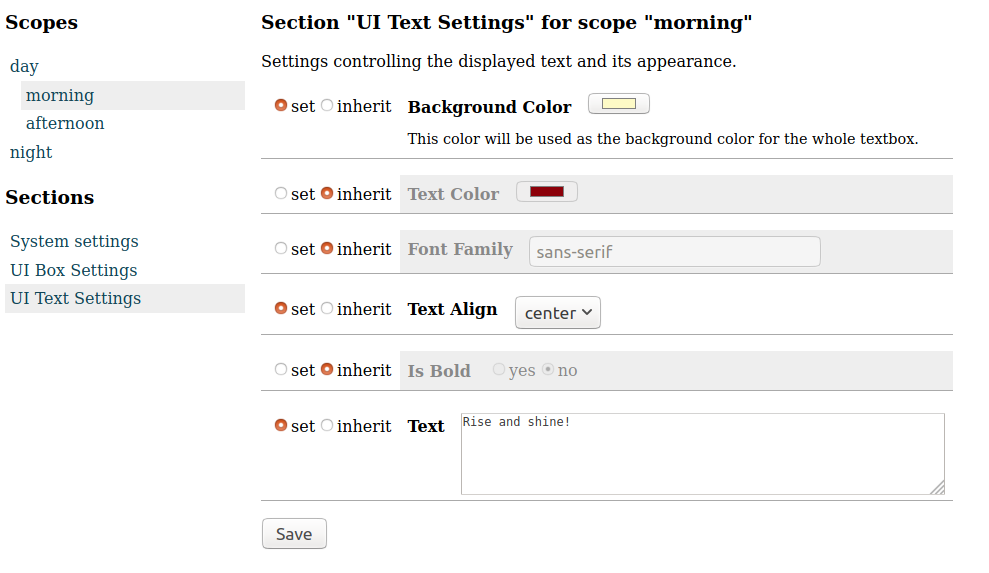

Tzunghaor Settings Bundle
========================= 



* Define your settings as php classes.
* Settings are stored in database in a single table.
* Bundle provides GUI to edit settings, customisable in setting definition classes.
* Define your scopes: each scope has its own settings, setting inheritance is supported.
* You can define multiple collections with different settings/scopes/config. 

You can take a look in the Tests/TestApp for working examples.


Installation
============

Make sure Composer is installed globally, as explained in the
[installation chapter](https://getcomposer.org/doc/00-intro.md)
of the Composer documentation.

Applications that use Symfony Flex
----------------------------------

Open a command console, enter your project directory and execute:

```console
composer require tzunghaor/settings-bundle
```

Applications that don't use Symfony Flex
----------------------------------------

### Step 1: Download the Bundle

Open a command console, enter your project directory and execute the
following command to download the latest stable version of this bundle:

```console
composer require tzunghaor/settings-bundle
```

### Step 2: Enable the Bundle

Then, enable the bundle by adding it to the list of registered bundles
in the `config/bundles.php` file of your project:

```php
// config/bundles.php

return [
    // ...
    Tzunghaor\SettingsBundle\TzunghaorSettingsBundle::class => ['all' => true],
];
```

Additional recommended packages
-------------------------------

* **phpdocumentor/reflection-docblock** - with this installed, you have more
    possibilities to define your settings  
* **symfony/asset** - the setting editor twig template uses asset() - if you
    don't have it installed, then you have to override __editor_page.html.twig__: 
    see [twig customization](docs/twig.md)
* **symfony/validator** - with this you can define validation rules on your
    setting classes that will be used in the setting editor. 
    See [symfony validation](https://symfony.com/doc/current/validation.html).
* **symfony/security-core** - using this you can create security voters to manage
    who can edit which settings. See [security voters](docs/voter.md)
    

Setup
=====

Database Setup
--------------

You need a database table to store your settings - the easiest way is to
use the entity definition provided by this bundle. If you have auto mapping
enabled in doctrine, then you can skip this configuration step.

```yaml
#config/packages/doctrine.yaml
doctrine:
  orm:
    auto_mapping: false
    mappings:
      Tzunghaor\SettingsBundle:
        type: annotation
          dir: '%kernel.project_dir%/vendor/tzunghaor/settings-bundle/src/Entity'
          prefix: 'Tzunghaor\SettingsBundle\Entity'
``` 

Create Table
------------

To actually create the table, use preferably doctrine migrations:

```sh
$ bin/console doctrine:migrations:diff
$ bin/console doctrine:migrations:migrate
```

or the fast and dangerous way on your developer machine:

```sh
$ bin/console doctrine:schema:update --force
```

[More about the database table](docs/database.md)

Defining Setting Classes
------------------------

You can define your settings in php classes (I will call such classes as 
setting sections, or simply sections), for example create a directory
for your settings (e.g. src/Settings), and create a BoxSettings.php in it:

```php
// src/Settings/BoxSettings.php
namespace App\Settings;
use Tzunghaor\SettingsBundle\Annotation\Setting;

class BoxSettings
{
    /**
     * @var int
     */
    public $padding = 0;

    /**
     * @var string[]
     * @Setting(enum={"bottom", "top", "left", "right"})
     */
    public $borders = [];
}
```

Since at the beginning no settings are stored in the database, it is best to set
sensible default values in your class.

[More about setting classes](docs/define_section.md)

Then tell the bundle where your settings classes are in the config:

```yaml
# config/packages/tzunghaor_settings.yaml
tzunghaor_settings:
  collections:
    # Each entry under "tzunghaor_settings" configures a setting collection.
    # Use "default" if you define only one collection
    default:
      mappings:
        # I used "default" as mapping name, but it is up to you.
        # You can have multiple mappings
        default:
          dir: '%kernel.project_dir%/src/Settings'
          prefix: App\Settings\
```

Now you can get your settings from the service provided by the bundle. 

```php
use App\Settings\BoxSettings;
use Tzunghaor\SettingsBundle\Service\SettingsService;

class MyService
{
    // ...
    
    public function __construct(SettingsService $settingsService)
    {
        /** 
         * declaring variable type for auto-complete support in IDE
         * @var BoxSettings $boxSettings 
         */
        $boxSettings = $settingsService->getSection(BoxSettings::class);
        $doublePadding = $boxSettings->padding * 2; 
```

More on [collections and services](docs/collections.md)

Setting up the editor
---------------------

> If you have **symfony/asset** installed then you can skip to setting up the route.
Otherwise you first have to 
overwrite a twig template: create a new directory in your application 
**templates/bundles/TzunghaorSettingsBundle**,
copy **Resources/views/editor_page.html.twig** to there, remove the "ts_stylesheets"
and "ts_javascripts" blocks, and use your method to load the .js and .css of the bundle.

Add the route defined by the bundle to your routes:

```yaml
# config/routes.yaml

tzunghaor_settings_editor:
  resource: '@TzunghaorSettingsBundle/config/routes.xml'
  prefix: '/settings'
```

Then go to `https://your.domain/settings/edit/` in your browser.

You probably want to set up some firewall rules in your security config for
this controller, and/or use [security voters](docs/voter.md).

You can have more control on the editor with route definition, 
see [routing](docs/routing.md).

Setting up cache
----------------

It is strongly advised to use a cache with this bundle, e.g.:

```yaml
# config/packages/tzunghaor_settings.yaml

tzunghaor_settings:
  collections:
    default:
      cache: 'cache.app'
```

Currently you need to clear the cache every time you do changes in your 
setting section classes.

Advanced Usage
==============

Using scopes
------------

If you need different values for the same setting in different scenarios,
then you can use scopes:

```yaml
# config/packages/tzunghaor_settings.yaml

tzunghaor_settings:
  collections:
    default:
      # tag aware cache needed when using nested scopes
      cache: 'cache.app.taggable'
      default_scope: day
      scopes:
        - name: day
          children:
            - name: morning
            - name: afternoon
        - name: night
```

Use only alphanumeric characters and underscores as scope names.

You can build arbitrary deep hierarchies (child nodes can have children, etc.), 
but if you use nested scopes (meaning you have at least one "children" node)
you will need a tag aware cache, 
see **Symfony\Contracts\Cache\TagAwareCacheInterface**.

The SettingsService::getSection() will use **default_scope** when called 
without subject. Otherwise you need to pass it the scope name as subject. 

It can be useful to have your webserver set an 
environment variable based on the request, and use that in your config:

```yaml
# config/packages/tzunghaor_settings.yaml

tzunghaor_settings:
  collections:
    default:
      default_scope: %env(DEFAULT_SCOPE)%
      ...
```

For more advanced use (e.g. having one scope per user), you can define your
own [scope provider](docs/scopes.md)
